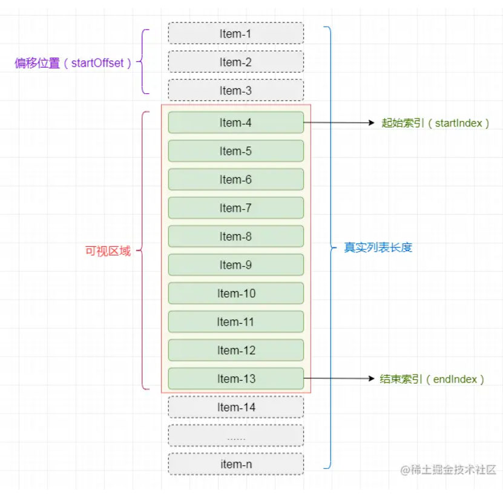

## 一、前端大文件切片上传 文件秒传 断点续传

### 文件切片：

- 计算文件的唯一值 hash值
  - 使用SparkMD5 的库进行计算文件hash值

- 传入的file对象，它继承于**Blob** , 根据规定的大小，调用 Blob.slice()  方法进行切片

### 创建文件上传列表：

 上传列表的每一项包括 ：

- 文件的切片
- 切片的下标
- 总文件的hash
- 文件类型

### 上传文件列表：

上传文件前，像后端发送检测请求，是否上传过该文件 

- 已经上传过 ，则直接获得链接，显示上传完成，实现**文件秒传**
- 上传过一些，但是不完全 。前端获取已经上传的文件数组下标，将未发送的文件列表进行上传，上传成功后调用合并接口
- 未上传过 。构建请求列表，调用promise.allSettled 进行上传 ，如果有reject 则根据下标进行重新上传。上传完毕之后，发送合并请求则实现大文件切片上传

### 功能优化:

- 在发送文件列表前的判断时，可以使用**web worker** 进行计算 
- 在上传文件列表时，可以控制并发数量减少浏览器负担

## 二、websocket长连接 

- 创建 初始化websocket    
- 监听  onopen  onmessage onclose onerror 事件  
- 设置心跳检测 
  - 客户端每隔一段时间向服务端发送一个数据包，服务端接收到数据包后会返回一个数据包则表示连接正常
  - 当在指定的时间内服务端并没有回应，表示连接已经断开，使用websocket.close断开连接
  - 这个关闭连接的操作可以在 onclose事件中监听到，则在onclose事件中调用reconnect函数进行重连

## 三、虚拟列表



- 计算出可视区的显示条数  visibleCount =   clientHeight / this.itemHeight

- 开始索引  start =   scrollTop /  this.itemHeight     	 

- 结束索引  end =  start  + visibleCount  (起始位置+显示条数)

- 展示区域的数据 visiableData = this.data.slice(start,end)

- 偏移量 ：  this.startOffset = scrollTop - (scrollTop % this.itemSize);   *//在这需要获得一个可以被itemHeight整除的数来作为item的偏移量*  

- 偏移量对应的style 

 ```
   getTransform(){
        return `translate3d(0,${this.startOffset}px,0)`;
   },
 ```

- 监听scroll 事件，每次滑动时重新计算偏移量 开始索引 结束索引 ，使用节流来优化 或者使用 window.requestAnimationFrame()进行优化

##  四、图片懒加载

原理：预先将图片的真实src放入自定义属性中，当图片进入到视口范围内后，将自定义属性的值赋值给src

- 获取浏览器视口高度
- 获取图片离顶部的高度

```js
//使用节流优化
let lazyload = function(){
       let scrollTop = document.body.scrollTop || document.documentElement.scrollTop; 	//获取浏览器滚动高度
           let height = window.innerHeight; 	//获取浏览器可视高度
           for(let i=0;i < imgs.length;i++){
               //如果元素距离文档顶部的高度小于浏览器的滚动高度加浏览器的可视高度，则需要加载
               if(imgs[i].offsetTop < scrollTop + height ){	  //imgs[i].offsetTop 距离文档顶部的高度           
	                   imgs[i].src = imgs[i].getAttribute('data-src'); //将data-src属性值赋值给src
	                   imgs[i].alt = 'loaded'
               }
           }
}

// getBoundingClientRect().top 为元素相对于窗口的位置；
//window.innerHeight 为当前窗口的高度；
//当元素对于窗口的位置小于当前窗口的高度时，那自然处于了窗口可视区了。
window.addEventListener("scroll", (e) => {
      ergodic();
    });
    function ergodic() {
      for (let i of images) {
        //计算方式和第一种方式不同
        if (i.getBoundingClientRect().top < window.innerHeight) {
          let trueSrc = i.getAttribute("data-src");
          i.setAttribute("src", trueSrc);
        }
      }
    }
    ergodic();

//调用IntersectionObserver  
//当一个IntersectionObserver对象被创建时，其被配置为监听根中一段给定比例的可见区域。
  function callback(entries) {
    for (let i of entries) {
      if (i.isIntersecting) {
          let img = i.target;
          let trueSrc = img.getAttribute("data-src");
          img.setAttribute("src", trueSrc);
          observer.unobserve(img);
      }
    } 
  }
      const observer = new IntersectionObserver(callback);
      for (let i of images) {
        observer.observe(i);
      }
```


## 五、消息通知功能实现